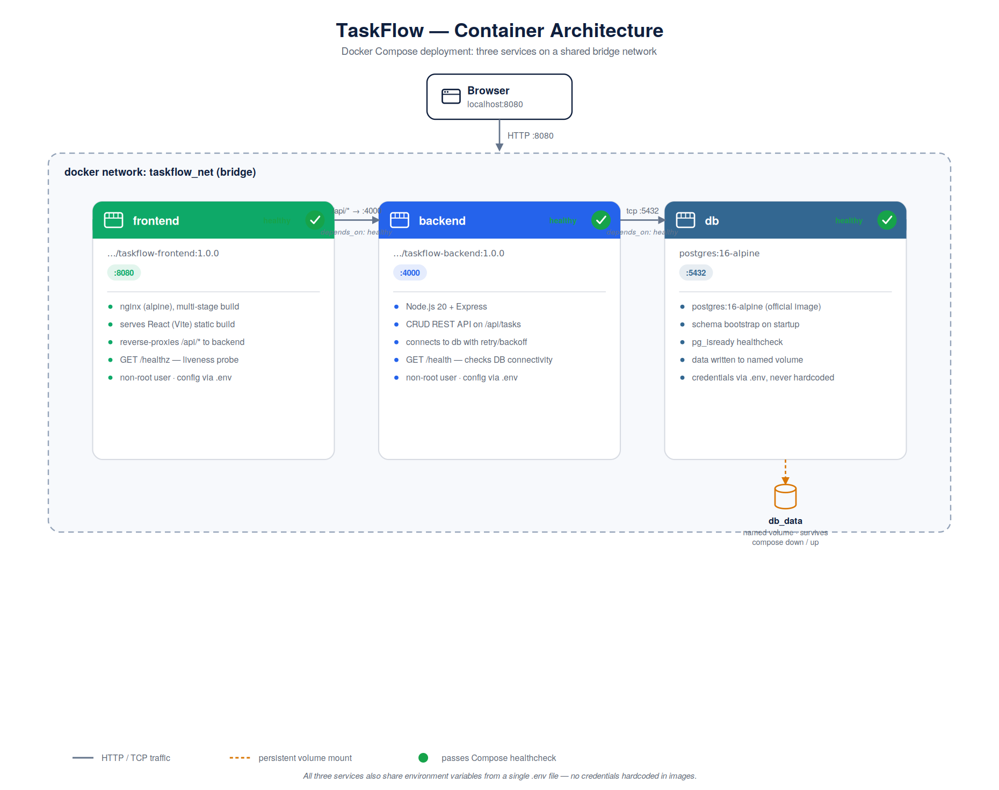

# TaskFlow

A production-grade, 3-tier containerized task-tracking app: **React (Vite) →
Node.js/Express → PostgreSQL**, fully orchestrated with Docker Compose and
published to Docker Hub. Built as a portfolio piece demonstrating multi-stage
Docker builds, non-root containers, healthchecks, environment-based config,
and a clean local-dev → publish → production workflow.
## Architecture



All three services share a custom bridge network and resolve each other by
Compose service name (`db`, `backend`, `frontend`) — no hardcoded IPs. The
frontend's nginx reverse-proxies `/api/*` to the backend, so the browser
never talks to the backend directly and no CORS configuration is needed.

## Tech stack

| Layer         | Technology                                  |
|---------------|----------------------------------------------|
| Frontend      | React 18 (Vite 5), served via nginx (alpine) |
| Backend       | Node.js 20, Express 4, `pg` driver           |
| Database      | PostgreSQL 16 (alpine)                       |
| Orchestration | Docker Compose (v2 syntax)                   |
| Registry      | Docker Hub                                   |

## Project structure

```
project-root/
├── backend/
│   ├── src/
│   │   ├── server.js        # Express app, startup sequence, graceful shutdown
│   │   ├── db.js            # Pool, connectWithRetry(), schema bootstrap
│   │   ├── healthcheck.js   # Used by Dockerfile HEALTHCHECK
│   │   └── routes/tasks.js  # CRUD routes
│   ├── package.json
│   ├── Dockerfile
│   └── .dockerignore
├── frontend/
│   ├── src/
│   │   ├── App.jsx          # Form + list UI
│   │   ├── api.js           # fetch wrapper, VITE_API_BASE_URL
│   │   └── index.css
│   ├── nginx.conf           # Serves SPA, proxies /api, exposes /healthz
│   ├── package.json
│   ├── Dockerfile
│   └── .dockerignore
├── docker-compose.yml        # Production: pulls images from Docker Hub
├── docker-compose.dev.yml    # Dev: builds images locally from source
├── .env.example               # Template — copy to .env
├── .gitignore
└── README.md
```

## Prerequisites

- Docker Engine 24+ and Docker Compose v2 (`docker compose version`)
- A Docker Hub account, if you intend to push your own images
- Node.js 20+ only if you want to run frontend/backend outside containers

## Setup instructions

1. **Clone the repo and configure environment variables**

   ```bash
   git clone <your-repo-url> taskflow && cd taskflow
   cp .env.example .env
   ```

   Edit `.env` and set real values — at minimum change `POSTGRES_PASSWORD` /
   `DB_PASSWORD` (they must match) and `DOCKERHUB_USERNAME` to your own
   Docker Hub username.

2. **Local development / testing (builds images from source)**

   ```bash
   docker compose -f docker-compose.dev.yml up --build
   ```

   This builds `frontend` and `backend` from their Dockerfiles, starts
   Postgres, and wires everything together. Visit:
   - Frontend: http://localhost:8080
   - Backend health: http://localhost:4000/health

3. **Verify, then publish images to Docker Hub** — see [Docker Hub
   Publishing](#docker-hub-publishing) below.

4. **Run the production compose file (pulls published images)**

   ```bash
   docker compose up -d
   docker compose ps
   ```

   Every service should show `healthy` within ~30 seconds.

## Docker Hub image links

Replace with your own after publishing:

- Backend: `https://hub.docker.com/r/ramkumar200314/taskflow-backend`
- Frontend: `https://hub.docker.com/r/ramkumar200314/taskflow-frontend`

## API endpoint documentation

Base path: `/api/tasks` (proxied through the frontend's nginx, or hit the
backend directly on its own port).

| Method | Path              | Body                              | Description                    |
|--------|-------------------|------------------------------------|---------------------------------|
| GET    | `/api/tasks`      | —                                   | List all tasks                 |
| POST   | `/api/tasks`      | `{ "title": "string" }`            | Create a task                  |
| PUT    | `/api/tasks/:id`  | `{ "title"?: string, "done"?: bool }` | Update a task's title and/or done state |
| DELETE | `/api/tasks/:id`  | —                                   | Delete a task (`204` on success)|
| GET    | `/health`         | —                                   | Backend liveness + DB check (`200` ok / `503` unhealthy) |

Example:

```bash
curl -X POST http://localhost:4000/api/tasks \
  -H "Content-Type: application/json" \
  -d '{"title":"Ship the demo"}'
```

## How to verify the end-to-end flow

1. **Check container health**

   ```bash
   docker compose ps
   # All three services should read "healthy"
   ```

2. **Backend health check**

   ```bash
   curl http://localhost:4000/health
   # {"status":"ok","db":"connected"}
   ```

3. **Frontend health check**

   ```bash
   curl http://localhost:8080/healthz
   # ok
   ```

4. **Full round trip via curl**

   ```bash
   curl -X POST http://localhost:8080/api/tasks -H "Content-Type: application/json" -d '{"title":"Test task"}'
   curl http://localhost:8080/api/tasks
   ```

   Note this hits the frontend's nginx on :8080, which proxies `/api/*` to
   the backend — proving the full path browser → frontend → backend → db.

5. **Full round trip via browser**

   Open http://localhost:8080, add a task in the input box, refresh the
   page — the task should persist (proving it round-tripped through
   Postgres, not just local React state). Double-click a task to rename it,
   click the checkbox to toggle done, click delete to remove it.

6. **Data persistence check**

   ```bash
   docker compose down
   docker compose up -d
   curl http://localhost:8080/api/tasks
   # Tasks created earlier should still be there — proves the named volume works
   ```

## Docker Hub Publishing

### Build and tag both images

```bash
docker build -t ramkumar200314/taskflow-backend:1.0.0 ./backend
docker build -t ramkumar200314/taskflow-frontend:1.0.0 ./frontend
```

### Log in to Docker Hub

```bash
docker login
```

### Push the versioned tags

```bash
docker push ramkumar200314/taskflow-backend:1.0.0
docker push ramkumar200314/taskflow-frontend:1.0.0
```

### Also tag and push `:latest`

```bash
docker tag ramkumar200314/taskflow-backend:1.0.0 ramkumar200314/taskflow-backend:latest
docker tag ramkumar200314/taskflow-frontend:1.0.0 ramkumar200314/taskflow-frontend:latest

docker push ramkumar200314/taskflow-backend:latest
docker push ramkumar200314/taskflow-frontend:latest
```

### Semantic versioning strategy

Tag images `MAJOR.MINOR.PATCH` (e.g. `1.2.3`):

- **MAJOR** — breaking changes (API contract changes, incompatible schema
  migrations that require manual intervention)
- **MINOR** — backward-compatible feature additions (new endpoint, new UI
  feature)
- **PATCH** — backward-compatible bug fixes only

Practical rules this repo follows:

- Never push over an existing versioned tag — versions are immutable.
  Cut a new tag for any change, however small.
- `latest` always points at the most recently published version — it is a
  convenience pointer, not a target for production `docker-compose.yml`
  pinning. Production and this repo's `docker-compose.yml` pin an explicit
  version via `IMAGE_TAG` in `.env` so deployments are reproducible and
  rollbacks are a one-line `.env` change.
- Consider also pushing a `git`-SHA-based tag (`sha-abc1234`) in CI for
  full traceability from a running container back to the exact commit.

## Troubleshooting

**Port already in use**
Another process is bound to 5432/4000/8080. Either stop it or change
`POSTGRES_PORT` / `BACKEND_PORT` / `FRONTEND_PORT` in `.env`, then
`docker compose up -d` again.

**Backend keeps restarting / "unhealthy"**
Check logs: `docker compose logs backend`. Common cause: `DB_PASSWORD` in
`.env` doesn't match `POSTGRES_PASSWORD` — Postgres will reject the
connection. Fix `.env` and run `docker compose down -v && docker compose up -d`
(the `-v` wipes the volume so Postgres re-initializes with the new
credentials — only do this if you don't need the existing data).

**"database is not ready yet" on first boot**
This is expected and handled automatically: the backend's
`connectWithRetry()` retries with exponential backoff, and Compose's
`depends_on: condition: service_healthy` + Postgres's own healthcheck
(`pg_isready`) mean the backend won't even start until the DB reports
healthy. If it still fails after ~30s, check `docker compose logs db`.

**Frontend loads but API calls fail (network error in browser console)**
Confirm you're hitting the frontend's own port (default 8080) and not
calling the backend's port directly from a different origin — the nginx
`/api/` proxy only exists on the frontend container. If you deliberately
want the frontend to call a backend on a different host, rebuild the
frontend image with `--build-arg VITE_API_BASE_URL=https://your-backend-host/api`.

**Data doesn't persist after `docker compose down`**
Make sure you didn't also pass `-v` (which deletes volumes). The named
volume `db_data` persists across `down`/`up` by design; `docker compose down -v`
is a deliberate full reset.

**`docker compose up` immediately exits / "pull access denied"**
You're on `docker-compose.yml` but haven't published images yet (or
`DOCKERHUB_USERNAME`/`IMAGE_TAG` in `.env` don't match what you pushed).
Use `docker-compose.dev.yml` for local builds, or fix the `.env` values to
match a real published image.

## Design notes / decisions

- **Retry/backoff, not just `depends_on`**: `depends_on: condition:
  service_healthy` prevents the backend container from *starting* before
  Postgres is healthy, but `connectWithRetry()` in `db.js` is a second,
  independent safety net inside the app itself — useful if Postgres
  restarts later during the container's lifetime, not just at boot.
- **nginx proxies `/api`** instead of the frontend calling an absolute
  backend URL from the browser: avoids CORS configuration entirely and
  keeps the deployed frontend portable (same image works regardless of
  what host/port the backend is reachable on, since routing happens
  server-side).
- **No `curl`/`wget`-only healthchecks reaching for extra packages**: the
  backend's HEALTHCHECK is a tiny Node script (`healthcheck.js`) so no
  additional OS packages need to be installed in the alpine image; the
  frontend uses `wget`, which alpine's busybox already ships with.
